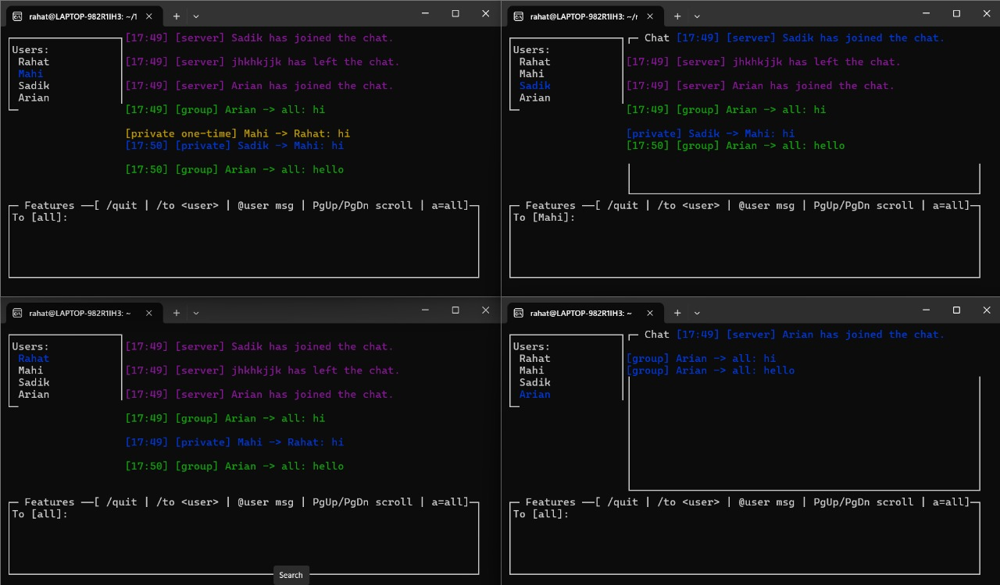
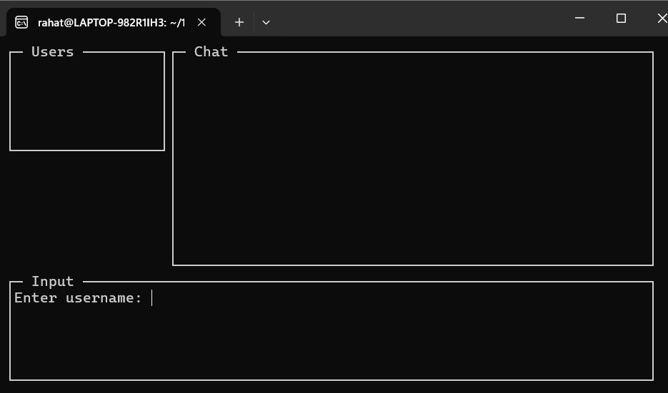
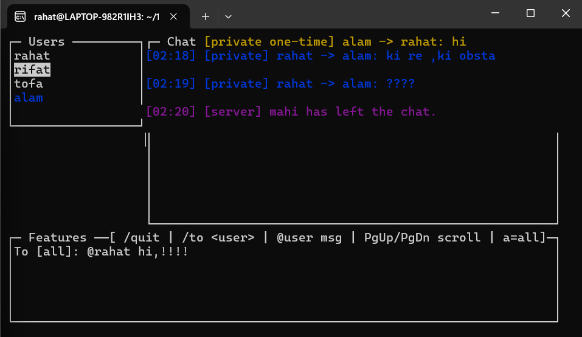
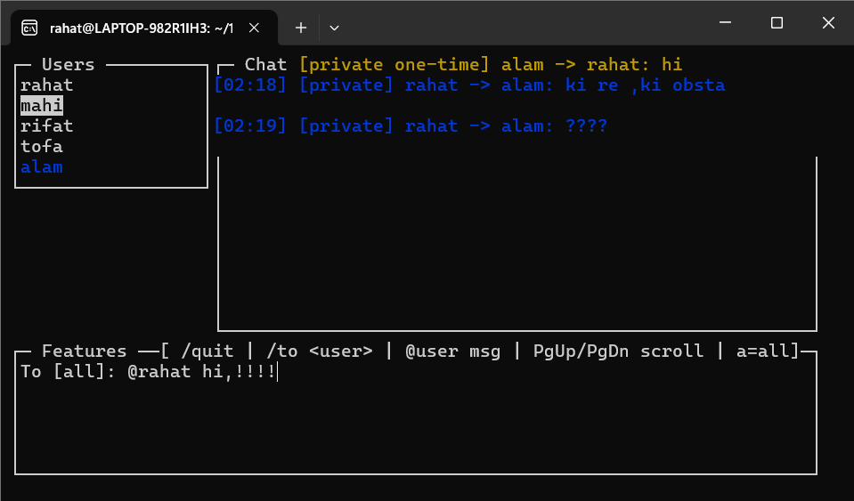
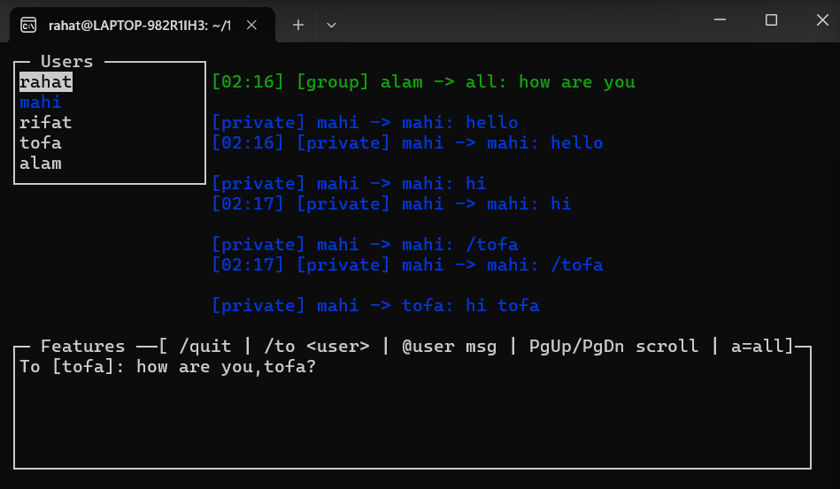
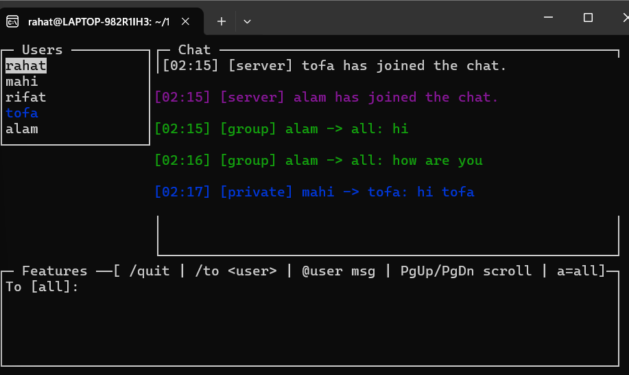
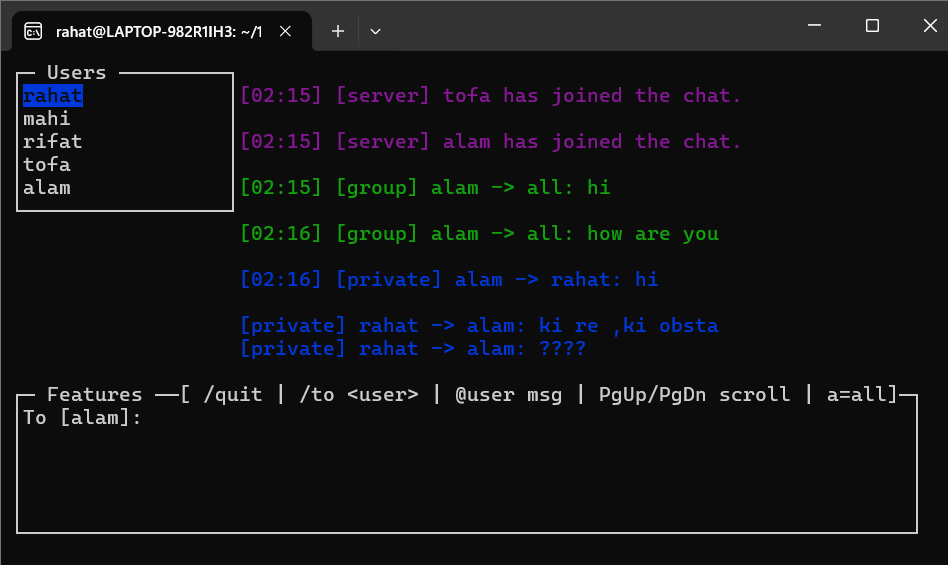
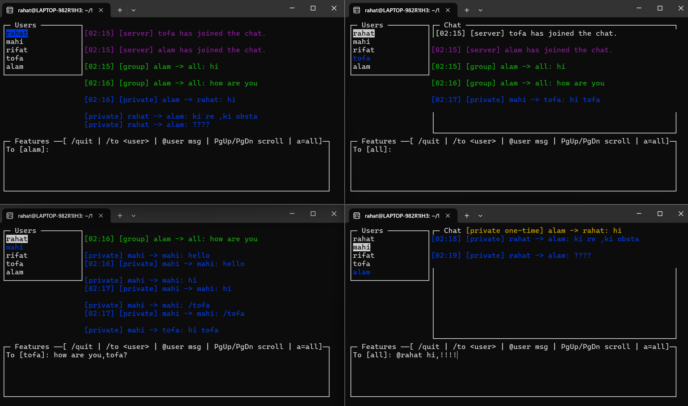

<div align="center">

# 💬 Terminal Chat Application

[](https://en.wikipedia.org/wiki/C_(programming_language))
[](LICENSE)
[]()

A real-time, multi-user terminal-based chat application built with **TCP sockets**, **POSIX threads**, and **ncurses** for an interactive TUI experience.


</div>

---

## 📋 Table of Contents

- [Features](#-features)
- [Architecture](#-architecture)
- [Prerequisites](#-prerequisites)
- [Installation](#-installation)
- [Usage](#-usage)
- [Commands](#-commands)
- [Protocol](#-protocol)
- [Project Structure](#-project-structure)
- [Screenshots](#-screenshots)
- [Contributing](#-contributing)
- [Author](#-author)
- [License](#-license)

---

## ✨ Features

### Server
| Feature | Description |
|---------|-------------|
| 🔄 Multi-client Support | Handles up to **100 concurrent clients** |
| 🔐 Username Validation | Unique, alphanumeric usernames (3-20 chars) |
| 📢 Broadcasting | Real-time join/leave notifications |
| 👥 User List Sync | Live active user list updates |
| 💾 Chat History | Persistent message logging to `chat_history.txt` |
| 🔒 Thread Safety | Mutex-protected shared resources |
| 🛑 Graceful Shutdown | Clean SIGINT handling |

### Client
| Feature | Description |
|---------|-------------|
| 🖥️ TUI Interface | 3-pane ncurses layout (Users \| Chat \| Input) |
| 🎨 Color Coding | Different colors for message types |
| 📜 Scroll Support | Navigate chat history with PgUp/PgDn |
| 🔍 Message Filtering | Filter messages by selected user |
| 📨 Private Messaging | Direct messages with `/to` or `@username` |
| ⌨️ Keyboard Navigation | Arrow keys for user list navigation |

---

## 🏗️ Architecture

```
┌─────────────────────────────────────────────────────────────┐
│                        SERVER                                │
│  ┌─────────────┐  ┌─────────────┐  ┌─────────────┐          │
│  │   Thread 1  │  │   Thread 2  │  │   Thread N  │          │
│  │  (Client 1) │  │  (Client 2) │  │  (Client N) │          │
│  └──────┬──────┘  └──────┬──────┘  └──────┬──────┘          │
│         │                │                │                  │
│         └────────────────┼────────────────┘                  │
│                          ▼                                   │
│              ┌─────────────────────┐                        │
│              │   Shared State      │                        │
│              │  (Mutex Protected)  │                        │
│              └─────────────────────┘                        │
└─────────────────────────────────────────────────────────────┘
                           │
                    TCP/IP Connection
                    (Framed Messages)
                           │
┌─────────────────────────────────────────────────────────────┐
│                        CLIENT                                │
│  ┌─────────────────────────────────────────────────────┐    │
│  │                    ncurses TUI                       │    │
│  │  ┌──────────┐  ┌────────────────────┐              │    │
│  │  │  Users   │  │       Chat         │              │    │
│  │  │  Panel   │  │       Panel        │              │    │
│  │  └──────────┘  └────────────────────┘              │    │
│  │  ┌──────────────────────────────────────────────┐  │    │
│  │  │              Input Panel                      │  │    │
│  │  └──────────────────────────────────────────────┘  │    │
│  └─────────────────────────────────────────────────────┘    │
└─────────────────────────────────────────────────────────────┘
```

---

## 📦 Prerequisites

- **GCC** compiler
- **POSIX Threads** (pthread)
- **ncurses** library

### Install Dependencies (Debian/Ubuntu)

```bash
sudo apt update
sudo apt install build-essential libncurses5-dev libncursesw5-dev
```

### Install Dependencies (Fedora/RHEL)

```bash
sudo dnf install gcc ncurses-devel
```

### Install Dependencies (Arch Linux)

```bash
sudo pacman -S gcc ncurses
```

---

## 🔧 Installation

### Clone the Repository

```bash
git clone https://github.com/YOUR_USERNAME/terminal-chat.git
cd terminal-chat
```

### Build Server

```bash
gcc bsse_1740_server.c -o bsse_1740_server -lpthread
```

### Build Client

```bash
gcc bsse_1740_client.c -o bsse_1740_client -lncurses -lpthread
```

### Quick Build (Both)

```bash
make all  # If Makefile is available
# OR
gcc bsse_1740_server.c -o server -lpthread && \
gcc bsse_1740_client.c -o client -lncurses -lpthread
```

---

## 🚀 Usage

### 1. Start the Server

```bash
./bsse_1740_server
```

Server will start listening on port **9000** by default.

```
Server started on port 9000
```

### 2. Connect Clients

```bash
./bsse_1740_client <server_ip> <port>
```

**Examples:**

```bash
# Local connection
./bsse_1740_client 127.0.0.1 9000

# LAN connection
./bsse_1740_client 192.168.1.100 9000

# WSL to Windows
./bsse_1740_client $(hostname -I | awk '{print $1}') 9000
```

### 3. Enter Username

When prompted, enter a valid username (3-20 alphanumeric characters).

---

## ⌨️ Commands

| Command | Description |
|---------|-------------|
| `/quit` | Exit the chat application |
| `/to <username>` | Set target for private messaging |
| `@username message` | Send one-time private message |
| `a` or `A` | Reset filter to show all messages |

### Keyboard Shortcuts

| Key | Action |
|-----|--------|
| `↑` / `↓` | Navigate user list |
| `PgUp` / `PgDn` | Scroll chat history |
| `Enter` | Select user as message target |

---

## 📡 Protocol

### Message Framing

All messages use a **length-prefixed framing** protocol:

```
┌──────────────────┬────────────────────────────┐
│  Length (4 bytes)│      Payload (N bytes)     │
│   Network Order  │                            │
└──────────────────┴────────────────────────────┘
```

### Message Format

```
type|sender|target|content\n
```

| Field | Description |
|-------|-------------|
| `type` | `group` or `private` |
| `sender` | Username of sender |
| `target` | `all` for group, username for private |
| `content` | Message content |

### Examples

```
group|Rahat|all|Hello everyone!
private|Rahat|Alice|Hey, how are you?
```

---

## 📂 Project Structure

```
terminal-chat/
├── 📄 bsse_1740_server.c      # Multi-threaded chat server
├── 📄 bsse_1740_client.c      # ncurses-based chat client
├── 📄 README.md               # This file
├── 📄 README.txt              # Original documentation
├── 📄 chat_history.txt        # Server-side message log
├── 📄 bsse_1740_short_report.txt
├── 📄 bsse_1740_test_input_file.txt
└── 📄 Terminal_Chat_Complete_Guide.pdf
```

---

## 🖼️ Screenshots

### Interface Preview

<div align="center">

| Screenshot | Description |
|:----------:|:-----------:|
|  | Server & Client Startup |
|  | User Login |
|  | Group Chat |
|  | Private Messaging |
|  | User List Navigation |
|  | Message Filtering |
|  | Chat History Scroll |
|  | Multi-Client Demo |

</div>

---

## ✅ Tested Platforms

| Platform | Status |
|----------|--------|
| Ubuntu 22.04 | ✅ Fully Working |
| Ubuntu 20.04 | ✅ Fully Working |
| Windows WSL2 | ✅ Works Well |
| Debian 11 | ✅ Fully Working |
| macOS | ⚠️ Minor UI differences |

---

## 🔮 Future Improvements

- [ ] TLS/SSL encryption for secure messaging
- [ ] Terminal window resize handling
- [ ] Reconnection with history sync
- [ ] File transfer support
- [ ] Emoji and UTF-8 support
- [ ] Room/Channel support
- [ ] Message search functionality

---

## 🤝 Contributing

Contributions are welcome! Please feel free to submit a Pull Request.

1. Fork the repository
2. Create your feature branch (`git checkout -b feature/AmazingFeature`)
3. Commit your changes (`git commit -m 'Add some AmazingFeature'`)
4. Push to the branch (`git push origin feature/AmazingFeature`)
5. Open a Pull Request

---

## 👨‍💻 Author

<table>
  <tr>
    <td align="center">
      <strong>Md. Tofazzol Alam Rahat</strong><br>
      📧 bsse1740@iit.du.ac.bd<br>
      🎓 BSSE-1740, Section B<br>
      🏫 Institute of Information Technology<br>
      University of Dhaka
    </td>
  </tr>
</table>

---

## 📚 References

- [Beej's Guide to Network Programming](https://beej.us/guide/bgnet/)
- [GNU ncurses Documentation](https://invisible-island.net/ncurses/)
- [POSIX Threads Programming](https://computing.llnl.gov/tutorials/pthreads/)

---

## 📄 License

This project is licensed under the MIT License - see the [LICENSE](LICENSE) file for details.

---

<div align="center">

**⭐ Star this repository if you found it helpful!**

Made with ❤️ for Structured Programming Laboratory

</div>
